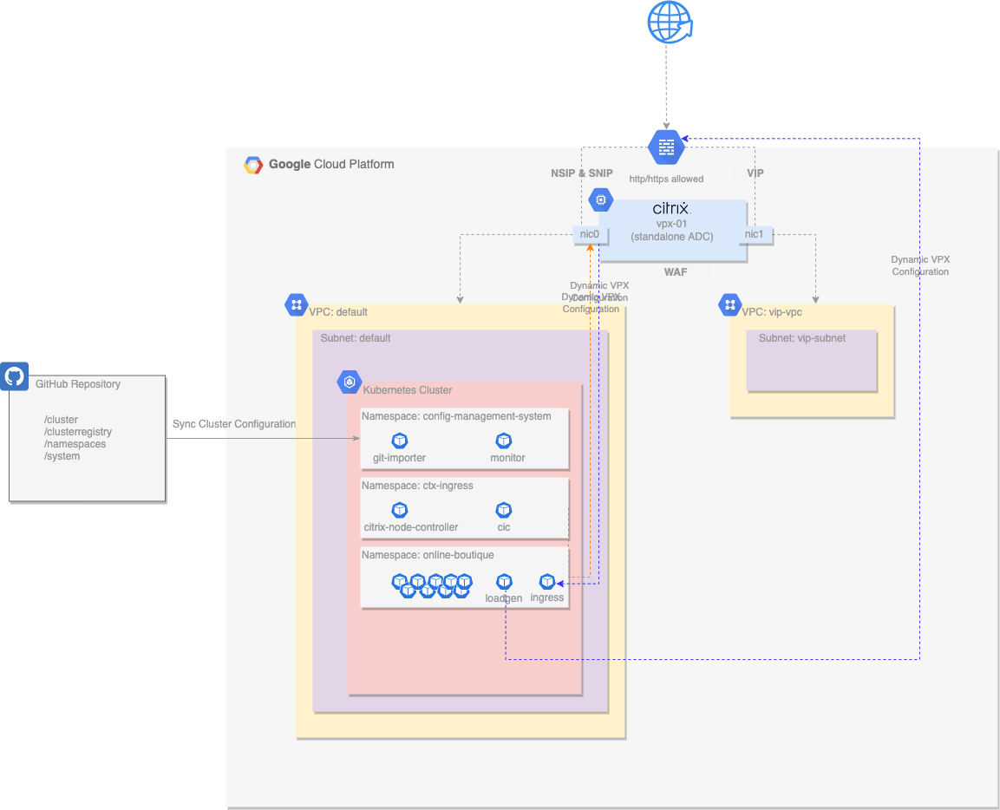
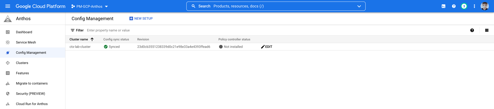

# Platform Engineer Persona

## The Setup



The diagram above illustrates the environment at a high-level. There is an Anthos GKE cluster managed from Anthos Configuration Management, with an external Citrix VPX to control ingress traffic into the cluster. This Citrix VPX appliance is managed by the network team and adheres to corporate application delivery standards.  

As a platform engineer, I am responsible for building and managing the life cycle of Anthos and ensuring that the platform is available and complies to my corporate standards. I also need to support the Network and Security teams objectives. This means ensuring that the cluster is secure and compliant by enforcing policies that ensure applications are deployed appropriately. 

## The Why
Deploying Citrix on Google Anthos Platform allows me, the platform engineer, to get secure and detailed insight into my platform's application network and related performance. It also allows me to enable developers to take control of the deployments to set specific network and security configurations using simple annotations or custom resources kubernetes manifests and namespaces. 

In this example, the cluster leverages Anthos Config Management to **ensure** the deployment and configuration of simple WAF with each appropriate policies to protect microservices deployed in a specific namespace. This is a simple example that shows how teams can make use of Citrix WAF CRDs to apply GitOps for Security.  

**Important**
Please note that ADC VPX security features require ADC to be licensed. After ADC VPX is in place, please make sure to follow the steps required to apply your license in one of the various ways that are supported. For simplicity, for this demonstration we are [Using a standalone Citrix ADC VPX license](lab-automation/Licensing.md). For production deployment scenarios you are encouraged to apply different licensing schemes.
- [Licensing overview](https://docs.citrix.com/en-us/citrix-adc/current-release/licensing.html)
- [Citrix ADC pooled capacity](https://docs.citrix.com/en-us/citrix-application-delivery-management-software/current-release/license-server/adc-pooled-capacity.html)

## The How

As a platform engineer, I own the Git repository that maintains the configuration for the Anthos GKE clusters with Google Anthos Configuration Management. As a result of using this solution, I am responsible for ensuring that the necessary Citrix manifests are present in the git repository and are configured in accordance with my Security and Network teams requirements. 

In this demonstration, there are three primary Citrix components that I am responsible for ensuring operate correctly: 
- Citrix Ingress Controller (CIC) which automatically configures Citrix ADC based on the Ingress resource configuration
- Citrix Node Controller (CNC) which creates network between the Kubernetes cluster and Citrix ADC controller
- Citrix WAF Custom Resource Definition which allows developers to create WAF configurations 

The two components will ensure that my Anthos GKE cluster is integrated with the appropriate upstream Citrix VPX. These components are comprised of a few Kubernetes manifests that must reside in the Git repo in order for Anthos Configuration Management to deploy them.

In this demonstration environment, a dedicated GitHub repo is created for ACM, and the following content is automatically placed into that repository within an `acm` folder. A dedicated namespace called `ctx-ingress` is created to hold the core Citrix deployments, while other system level manifests are located in the `cluster` directory of the ACM repository. 
- Deployments
  - https://github.com/<github_owner>/<github_reponame>/acm/namespaces/ctx-ingress/cic-deployment.yaml
  - https://github.com/<github_owner>/<github_reponame>/acm/namespaces/ctx-ingress/cnc-deployment.yaml
- Config Maps
  - https://github.com/<github_owner>/<github_reponame>/acm/namespaces/ctx-ingress/cnc-configmap.yaml
- Service Accounts
  - https://github.com/<github_owner>/<github_reponame>/acm/namespaces/ctx-ingress/cnc-service-account.yaml
  - https://github.com/<github_owner>/<github_reponame>/acm/namespaces/ctx-ingress/cpx-ingress-serviceaccount.yaml
- Roles
  - https://github.com/<github_owner>/<github_reponame>/acm/cluster/cnc-clusterrole.yaml
  - https://github.com/<github_owner>/<github_reponame>/acm/cluster/cpx-clusterrole.yaml
- Rolebindings
  - https://github.com/<github_owner>/<github_reponame>/acm/cluster/cnc-clusterrolebinding.yaml
  - https://github.com/<github_owner>/<github_reponame>/acm/cluster/cpx-clusterrolebinding.yaml
- Custom Resource Definitions
  - https://github.com/<github_owner>/<github_reponame>/acm/cluster/waf-crd.yaml


### Deployment Validation
With the above manifests being synced to the Anthos GKE cluster; 

- Validate that Anthos Configuration Management pods are running
  ```shell
  $ kubectl get pods -n config-management-system
  NAME                                            READY   STATUS    RESTARTS   AGE
  config-management-operator-75bcc8dcc9-ltqpm     1/1     Running   6          12h
  reconciler-manager-6f64d4f564-xgj94             2/2     Running   0          12h
  root-reconciler-7cffb785fc-dlc7p                4/4     Running   0          12h

  $ kubectl get pods -n gatekeeper-system
  NAME                                            READY   STATUS    RESTARTS   AGE
  gatekeeper-audit-5d4d474f95-g5zqd               1/1     Running   0          12h
  gatekeeper-controller-manager-76d777ddb8-zc758  1/1     Running   0          12h
  
- Validate that the following CRD exist
  ```
  $ kubectl get crd 
  NAME                                                                CREATED AT
  wafs.citrix.com                                                     2022-02-02T01:46:50Z
  ```
  You can also validate the Anthos Configuration Management status from the Google Cloud Console.   

- Validate that the Citrix Ingress and Node Controller pods are running
  ```shell
  $ kubectl get pods -n ctx-ingress
  NAME                                                              READY   STATUS    RESTARTS   AGE
  cic-k8s-ingress-controller-9f7559c7d-l7tt8                        1/1     Running   0          37m
  citrix-node-controller-579dfc466f-g5v27                           1/1     Running   0          37m
  kube-cnc-router-gke-ctx-lab-cluster-ctx-lab-nodes-6f50cacc-8p7n   1/1     Running   0          37m
  ```


## Summary

As a platform engineer my primary purpose is to apply software engineering principles to accelerate software delivery.  My goals are: 

* Ensure application development teams are productive in all aspects of the software delivery life cycle without depending on external teams
* Network teams have access to network resources insight into metrics and usage 
* Security teams have insight into all aspects of the platform and specifically network traffic passing in and out of the platform 
* Clusters enforce policy set out by the Network and Security teams

A key aspect of my job function is to ensure a secure, reliable and scalable network solution that allows other teams to effectively execute their tasks. Using Citrix ADC, Citrix Ingress Controller, and WAF in a Google Anthos platform with Config Management and Policy Controller allows my team to achieve this goal.
